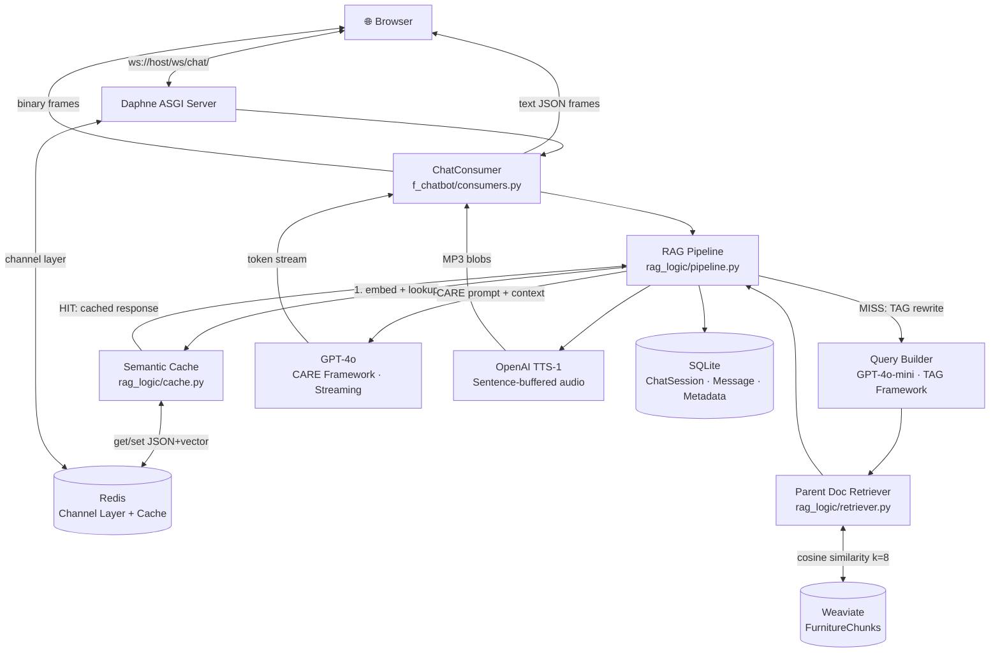
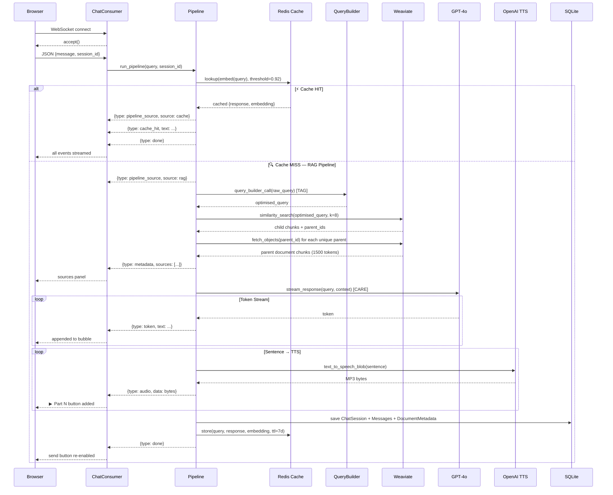
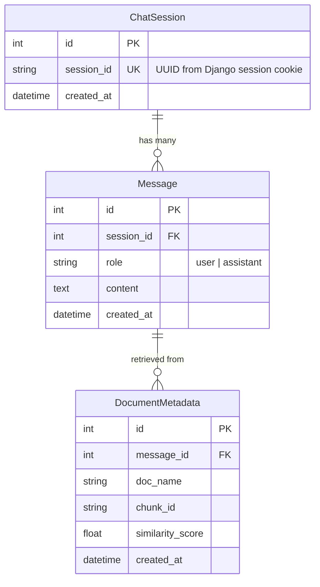

# 🪑 Woodsy — Furniture RAG Chatbot

> Real-time RAG pipeline · WebSocket streaming · Semantic caching · TTS audio  
> **Django Channels + Weaviate + Redis + OpenAI GPT-4o**

---

## Table of Contents

1. [Overview](#overview)
2. [Architecture](#architecture)
3. [Execution Flow (Sequence Diagram)](#execution-flow)
4. [Database Schema (ERD)](#database-schema)
5. [Project Structure](#project-structure)
6. [Module Reference](#module-reference)
7. [How Caching Works](#how-caching-works)
8. [How Weaviate Works](#how-weaviate-works)
9. [Setup & Run](#setup--run)
10. [Docker](#docker)
11. [WebSocket Event Protocol](#websocket-event-protocol)

---

## Overview

Woodsy answers customer questions about furniture products, care guides, warranty policies, and FAQs. It retrieves relevant knowledge from Weaviate and streams GPT-4o responses token-by-token over WebSockets. Semantically similar questions are served instantly from a Redis cache.

| Layer | Technology |
|---|---|
| Web Framework | Django 4.2 (ASGI) |
| Real-time | Django Channels + Daphne |
| Vector DB | Weaviate Cloud (WCS) |
| Semantic Cache | Redis (cosine similarity) |
| Session / History | SQLite + Django ORM |
| LLM | OpenAI GPT-4o (CARE prompt) |
| Query Builder | OpenAI GPT-4o-mini (TAG prompt) |
| Embeddings | text-embedding-3-small |
| TTS | OpenAI TTS-1 (nova voice) |

---

## Architecture



---

## Execution Flow



---

## Database Schema



---

## Project Structure

```
Furniture_chatbot/
├── manage.py
├── Furniture_chatbot/
│   ├── settings.py          # Django config: Channels, Redis, env vars
│   ├── asgi.py              # ASGI entry: HTTP + WebSocket routing
│   └── urls.py              # Global HTTP URL routing
├── f_chatbot/
│   ├── migrations/
│   ├── templates/f_chatbot/
│   │   ├── index.html       # Landing page
│   │   └── chat.html        # Chat UI (WebSocket client + indicators)
│   ├── management/commands/
│   │   └── ingest.py        # CLI: chunk → embed → push to Weaviate
│   ├── models.py            # ChatSession, Message, DocumentMetadata
│   ├── views.py             # HTTP views: index, chat
│   ├── routing.py           # WebSocket URL → ChatConsumer
│   ├── consumers.py         # AsyncWebsocketConsumer
│   └── rag_logic/
│       ├── pipeline.py      # Main orchestrator (async generator)
│       ├── cache.py         # Redis semantic cache
│       ├── prompts.py       # TAG + CARE prompt templates
│       ├── retriever.py     # Weaviate client + parent-doc retriever
│       ├── llm_client.py    # OpenAI text generation
│       └── tts_client.py    # TTS sentence buffer + blob generation
├── data/raw_docs/           # Drop PDFs, CSVs, TXTs, JSONs here
├── .env                     # Secrets (gitignored)
├── requirements.txt
├── Dockerfile
└── docker-compose.yml
```

---

## Module Reference

| Module | File | Role |
|---|---|---|
| `settings.py` | `Furniture_chatbot/settings.py` | CHANNEL_LAYERS, DATABASES, env loading |
| `asgi.py` | `Furniture_chatbot/asgi.py` | ProtocolTypeRouter — HTTP vs WebSocket |
| `routing.py` | `f_chatbot/routing.py` | `path("ws/chat/")` → ChatConsumer |
| `consumers.py` | `f_chatbot/consumers.py` | Drives pipeline, streams text + binary frames |
| `pipeline.py` | `f_chatbot/rag_logic/pipeline.py` | `run_pipeline()` async generator |
| `cache.py` | `f_chatbot/rag_logic/cache.py` | `lookup()`, `store()` with cosine similarity |
| `prompts.py` | `f_chatbot/rag_logic/prompts.py` | `tag_prompt`, `care_prompt` |
| `retriever.py` | `f_chatbot/rag_logic/retriever.py` | `get_weaviate_client()`, `retrieve_parent_docs()` |
| `llm_client.py` | `f_chatbot/rag_logic/llm_client.py` | `query_builder_call()`, `stream_response()` async gen |
| `tts_client.py` | `f_chatbot/rag_logic/tts_client.py` | `SentenceBuffer`, `text_to_speech_blob()` |
| `ingest.py` | `f_chatbot/management/commands/ingest.py` | `python manage.py ingest` |
| `models.py` | `f_chatbot/models.py` | SQLite ORM schema |

---

## How Caching Works

**File:** `f_chatbot/rag_logic/cache.py`

```
Query arrives
    │
    ▼
Embed with text-embedding-3-small
    │
    ▼
Scan all "semcache:*" keys in Redis
    │
    ▼
Compute cosine similarity vs each stored embedding
    │
    ├─ score ≥ 0.92 ──► Return cached response  →  pipeline_source: "cache"
    │
    └─ score < 0.92 ──► Cache MISS  →  Run RAG pipeline
                                           │
                                           ▼
                                     After generation:
                                     store(query, response, embedding)
                                     key = "semcache:<sha256(query)>"
                                     TTL = 7 days
```

**Storage format per Redis key:**
```json
{
  "query": "original question text",
  "embedding": [0.021, -0.003, ...],   // 1536 floats
  "response": "full assistant response"
}
```

**UI indicators:** Header pill shows `⚡ Cache Hit` (amber) or `🔍 Live RAG` (green). Each message bubble is permanently tagged with its source.

---

## How Weaviate Works

**File:** `f_chatbot/rag_logic/retriever.py`

### Collection: `FurnitureChunks`

| Property | Type | Description |
|---|---|---|
| `content` | TEXT | Chunk text |
| `doc_name` | TEXT | Source filename |
| `chunk_id` | TEXT | This chunk's UUID |
| `parent_id` | TEXT | Parent chunk UUID |
| `is_parent` | BOOL | True = parent, False = child |

### Parent Document Retriever

```
Documents split into TWO levels:

Child chunks (300 tokens)          Parent chunks (1500 tokens)
───────────────────────            ──────────────────────────
Used for vector search             Returned to LLM for context
High precision retrieval           Rich, coherent context window

At query time:
  1. Search child chunks by cosine similarity (k=8)
  2. Collect unique parent_ids from results
  3. Fetch full parent chunks from Weaviate
  4. Send parent content to GPT-4o
```

### Why `python manage.py ingest`?

Weaviate needs vectors pre-loaded before any search. `ingest.py`:
1. Loads PDF/CSV/TXT/JSON from `data/raw_docs/`
2. Splits into parent chunks (1500 tok) → child chunks (300 tok)
3. Embeds each with `text-embedding-3-small`
4. Batch-inserts into Weaviate with `insert_many()`

---

## Setup & Run

### 1. Install dependencies
```bash
python -m venv envFChat
envFChat\Scripts\activate          # Windows
pip install -r requirements.txt
```

### 2. Configure environment
```bash
copy .env.example .env
# Fill in: OPENAI_API_KEY, WEAVIATE_URL, WEAVIATE_API_KEY
```

### 3. Start Redis (Windows 11)
```bash
# Foreground
redis-server
Option B — Background service (recommended):
# Install as a Windows service (run once)
redis-server --service-install

# Start the service
redis-server --service-start

# Stop the service
redis-server --service-stop
# Verify Redis is running:
redis-cli ping
# Should return: PONG


# OR as a Windows service
redis-server --service-install
redis-server --service-start

# Test
redis-cli ping          # → PONG
redis-cli keys "semcache:*"   # → list cached queries
```

### 4. Database migration
```bash
python manage.py makemigrations
python manage.py migrate
```

### 5. Collect static files
```bash
python manage.py collectstatic --noinput
```

### 6. Ingest documents
```bash
# Drop files into data/raw_docs/ then:
python manage.py ingest
```

### 7. Start server
```bash
# ⚠️  Always use Daphne — never runserver (WSGI can't handle WebSockets)
daphne -b 127.0.0.1 -p 8000 Furniture_chatbot.asgi:application
```

Open: http://127.0.0.1:8000

### Startup Checklist
- [ ] `.env` file has all keys set  
- [ ] Virtual environment activated  
- [ ] `redis-cli ping` → PONG  
- [ ] `python manage.py migrate` done  
- [ ] `data/raw_docs/` has documents  
- [ ] `python manage.py ingest` completed  
- [ ] `daphne` running on port 8000  

---

## Docker

### Start everything
```bash
docker compose up --build
```

### Ingest documents (first run)
```bash
docker compose exec web python manage.py ingest
```

### Access
- App: http://localhost:8000  
- Redis CLI: `docker compose exec redis redis-cli ping`

---

## WebSocket Event Protocol

**Client → Server** (JSON):
```json
{ "message": "What sofas do you have?", "session_id": "uuid-here" }
```

**Server → Client** (text frames = JSON, binary frames = MP3):

| Event Type | Fields | Description |
|---|---|---|
| `pipeline_source` | `source: "cache"\|"rag"` | First event. Indicates answer origin. |
| `cache_hit` | `text: str` | Full response from cache. No tokens follow. |
| `metadata` | `sources: [{doc_name, chunk_id, similarity_score}]` | Retrieved documents. |
| `token` | `text: str` | Single LLM token. Append to display. |
| `(binary)` | `ArrayBuffer (MP3)` | TTS audio blob. One per sentence. |
| `done` | — | Stream complete. |
| `error` | `message: str` | Pipeline error. |

---

## Environment Variables

| Variable | Description |
|---|---|
| `DJANGO_SECRET_KEY` | Django secret key |
| `OPENAI_API_KEY` | OpenAI API key |
| `WEAVIATE_URL` | Weaviate cluster URL |
| `WEAVIATE_API_KEY` | Weaviate API key |
| `REDIS_URL` | Redis URL (default: `redis://127.0.0.1:6379`) |


How to Run
1. Install dependencies
bashpip install -r requirements.txt
2. Start Redis (Windows 11)
bashredis-server
# or in background: redis-server --daemonize yes
```
Redis defaults to `127.0.0.1:6379` — already configured in `.env.example`.

### 3. Create `.env` from the template
```
cp .env.example .env
# Fill in OPENAI_API_KEY, WEAVIATE_URL, WEAVIATE_API_KEY
4. Django setup
bashpython manage.py migrate
python manage.py createsuperuser  # optional
5. Ingest your documents
Drop PDFs, CSVs, TXTs, or JSONs into data/raw_docs/, then:
bashpython manage.py ingest
6. Run the server (ASGI via Daphne)
bashdaphne -b 0.0.0.0 -p 8000 Furniture_chatbot.asgi:application
Open http://localhost:8000 — you'll see the Woodsy landing page.

Architecture at a glance
FileRoleasgi.py + routing.pyRoutes HTTP → Django, WebSocket → ChatConsumerconsumers.pyReceives WS messages, drives pipeline, streams events backpipeline.pyOrchestrates: cache → query builder → retrieval → LLM stream → TTS → DB savecache.pyRedis semantic cache using cosine similarity on embeddingsretriever.pyWeaviate parent-child retriever (child for search, parent for LLM context)llm_client.pyTAG query builder (gpt-4o-mini) + CARE streamer (gpt-4o)tts_client.pySentence-buffered async TTS → MP3 binary blobsingest.pyCLI command to chunk and push docs into Weaviate
